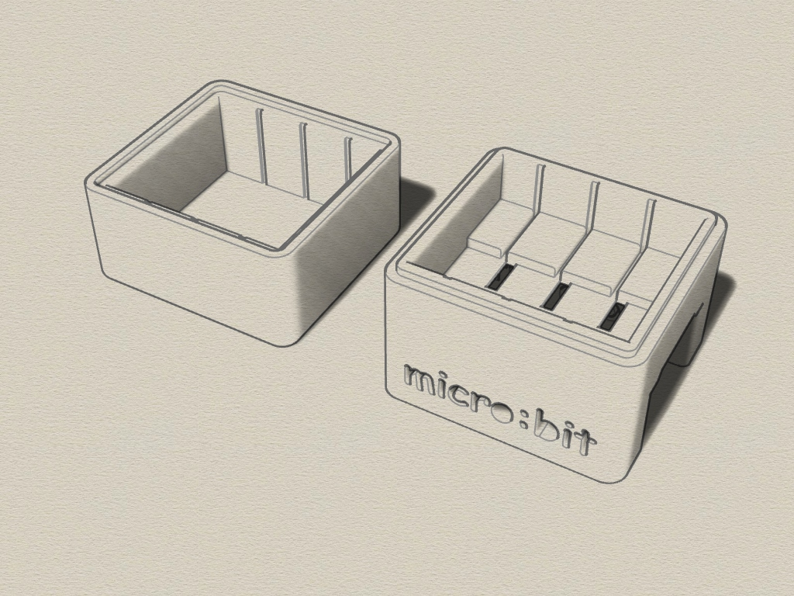
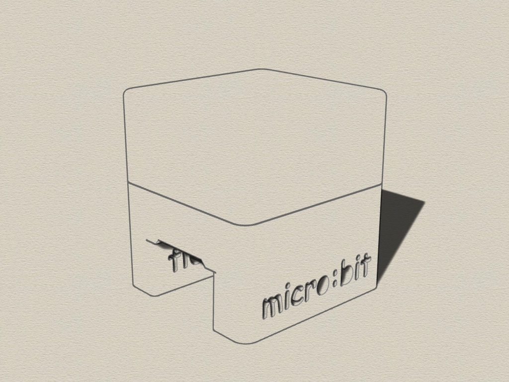

# Micro-Bit-3x-enclosure
3D printable enclosure for 3 BBC Micro:Bit devices, created with Rhino 6.

#### 3D Case
The enclosure consists of 2 parts which are clamped together (no screws). 

Requirements:
* 3D printer 
* Filament of your choice

#### View
 
 
